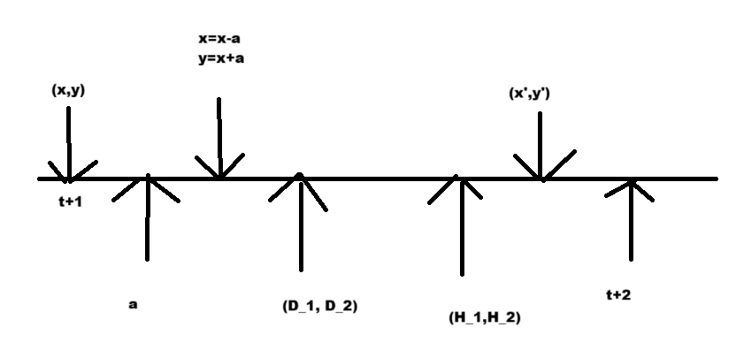

## Exercise 7.8.2 - Car rental

> Consider a rental company with two locations, each with a capacity of 20 cars. Each day, customers arrive at each location to rent cars. If a car is available, it is rented out with a reward of $10. Otherwise the opportunity is lost. Cars become available for renting the day after they are returned. 

> The number of cars rental requests $D_i$ at Location $i=1,2$ are Poisson distributed with mean 3 and 4. Similar, the number of cars returned $H_i$ at Location $i=1,2$ are Poisson distributed with mean 3 and 2. Cars returned resulting in more cars than the capacity are lost (and thus disappear from the problem). 

> To ensure that cars are available where they are needed, they can be moved between the two locations overnight, at a cost of $2 per car. A maximum of five cars can be moved from one location to the other in one night. 

> Formulate the problem as an finite MDP where the time-steps are days.

1) Define the state space (with states $(x,y)$) equal the number of cars at each location at the end of the day.

The information you need to take an action is the state space. A vector (x,y). 

$$ \mathcal{S} = \{x,y| 0\le x\le 20, 0\le y \le 20 \}$$

There are $21^2$ different states. 

2. Define the action space equal the net numbers of cars moved from Location 1 to Location 2 overnight, i.e. negative if move from Location 2 to 1.

The action space is the following:

$$A(s) = \{-5, -4, \cdots ,4, 5\} $$

however we cannot move more than X or 20-y.

$$ A(s) = \{a\in \mathbb{Z} | -\text{min}(5,y, 20-x) | \le a\le \text{min}(5,x, 20-y)\} $$

3. Calculate the expected reward $r(s,a)$

$$R = 10\cdot (\text{min}(\bar x, D_1)+\text{min}(\bar y, D_2) y-y')-2|a|$$

Note that R is a stochastic variable, and we want the expectation.

$$r(s,a)=E(K)=10(E(*)+F(\Delta))-2|a|$$

The actual calculation is the following:

$$E(\text{min}(D,z))=\sum_{i=0}^z p(D=i)+(1-p(D\le z)) \cdot z$$

> Note the inventory dynamics (number of cars) at each parking lot is independent of the other given an action $a$. Let us consider Location 1 and assume that we are in state $x$ and chose action $a$. Then the number of cars after movement is $x - a$ and after rental requests $x - a - \min(D_1, x-a)$. Next, the number of returned cars are added: $x - a - \min(D_1, x-a) +  H_1$. Finally, note that if this number is above 20 (parking lot capacity), then we only have 20 cars, i.e. the inventory dynamics (number of cars at the end of the day) is $$X = \min(20,  x-a - \min(D_1, x-a) +  H_1))).$$

4) Give the inventory dynamics for Location 2.

For location 2, it would be the opposite of location 1.

$$Y = \min(20,y + a - \min(D_2, y+a) +  H_2)))$$

Notated $Y$ as it is a stochastic variable. 

The transition probabilities.

$$p(s'|s,a)=p((\bar x, \bar y)|(x,y),a)$$

The two probabilties are independent, so they can be split.

$$p(s'|s,a)=p(x'|x,a)\cdot p(y'|y,a)=p(x'|\bar x)\cdot p(y'|\bar y)$$

using the fucntions below, they can be rewritteh with the bars.

$$p(x'|x,a)=pr(x'< \min(20, \bar x - \min(\bar x, D_1)+H_1))$$

$$\text{pr}(x'|\bar x)$$

It is easier to only store $\bar x$ in python, as it is only one variable. The needed probabilities are $p(x'|\bar x)$ and $p(y'|\bar y)$, which are to large matrices. 